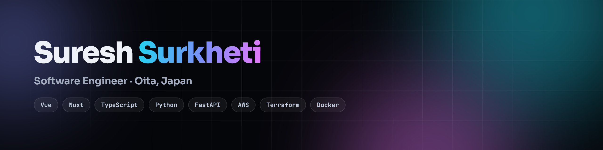

<picture>
  <source media="(prefers-color-scheme: dark)" srcset="banner-dark.png">
  <source media="(prefers-color-scheme: light)" srcset="banner-light.png">
  
</picture>

  I build web platforms for Japanese municipalities and enterprise clients — 
  Vue, Nuxt and TypeScript on the front, Python and FastAPI behind it, deployed on AWS.

  
  
  
  

---

### Selected work

| | |
|:--|:--|
| **[jlpt-practice](https://github.com/SureshSurkheti/jlpt-practice)** | Free JLPT mock exams from N5 to N1 — 148 timed papers, marked automatically, with listening audio and answer explanations. Every question opens its own vocabulary with furigana, and all twelve languages get their own URL and hreflang. → **[nihongomock.com](https://nihongomock.com)** |
| **[nepal-oita-community](https://github.com/SureshSurkheti/nepal-oita-community)** | Live community site for Nepalis in Oita and Beppu — events, notices and local guidance. Next.js and TypeScript, with the data layer written as PostgreSQL procedures rather than pushed into the app. → **[nepaloitacommunity.com](https://nepaloitacommunity.com)** |
| **[portfolio](https://github.com/SureshSurkheti/portfolio)** | My personal site. No framework and no build step — hand-written HTML, CSS and vanilla JavaScript, with every animation done in the browser rather than pulled from a library. → **[sureshsurkheti.com](https://sureshsurkheti.com)** |
| **[my-blog](https://github.com/SureshSurkheti/my-blog)** | Django blog with Markdown posts, drafts, galleries, moderated comments, tags, search and RSS. Travel writing about Kyushu — live, and still growing. → **[blog.sureshsurkheti.com](https://blog.sureshsurkheti.com)** |
| **[ollama-local-mcp](https://github.com/SureshSurkheti/ollama-local-mcp)** | A ReAct agent running entirely on a local Ollama model, calling four MCP tool servers I wrote — weather, math, calendar and translator. LangGraph with the LangChain MCP adapters; no hosted API involved. |
| **[Shopiverse](https://github.com/SureshSurkheti/Shopiverse)** | Nuxt storefront taken all the way through — register, log in, browse, search, cart, checkout and Stripe payment intents, plus a seller listing flow. Prisma schema with migrations and seed data. |
| **[cinemate](https://github.com/SureshSurkheti/cinemate)** | Nuxt and TypeScript film browser — now playing, popular, top rated, upcoming and search, each behind its own server API route so the API key never reaches the client. |
| **[nuxtcurrencyapp](https://github.com/SureshSurkheti/nuxtcurrencyapp)** | A Nuxt sandbox worked through one concept at a time — server routes, middleware, full REST CRUD, dynamic params, composable state and error handling. |

<b>Earlier work</b> — seven more repositories, mostly from learning

 

| | |
|:--|:--|
| **[randoms](https://github.com/SureshSurkheti/randoms)** | A mock REST API served from Nuxt server routes — posts, products and celebrities with full CRUD — with its own documentation site built on Nuxt Content. |
| **[Help-App](https://github.com/SureshSurkheti/Help-App)** | React Native (Expo) emergency assistance app — login, live geolocation, Google Places search, patient details and push notifications, on Firebase. |
| **[LiveLocation](https://github.com/SureshSurkheti/LiveLocation)** | React Native (Expo) experiment in continuous live location tracking, including patched native modules. |
| **[RNLEARN](https://github.com/SureshSurkheti/RNLEARN)** | React Native practice — rebuilding a Netflix-style card component while learning the framework's layout model. |
| **[REST-API-STORAGE](https://github.com/SureshSurkheti/REST-API-STORAGE)** | Django REST Framework practice API — models, serializers, viewsets and routed endpoints. One of my first backend projects. |
| **[Blog](https://github.com/SureshSurkheti/Blog)** | A static multi-page blog layout in plain HTML and CSS, from early front-end practice. |
| **[invoice](https://github.com/SureshSurkheti/invoice)** | A static invoice interface — login screen and invoice layout, in HTML and CSS. |

→ everything else in the <a href="https://github.com/SureshSurkheti?tab=repositories">repositories</a> tab

---

### Stack

  
  
  
  
  
  
   
  
  
  
  
  
   
  
  
  
  
  

| | |
|:--|:--|
| **Frontend** | TypeScript · JavaScript · Vue · Nuxt · Next.js · Svelte · Tailwind · Vuetify · Pinia |
| **Backend** | Python · FastAPI · Django · PostgreSQL · MySQL · DynamoDB |
| **Cloud** | AWS (EC2, ECS/Fargate, Lambda, RDS, S3, CloudFront, Cognito, IAM) · Terraform · Docker |
| **Testing** | Playwright · Pytest |
| **Mobile** | Objective-C · Xcode · React Native |

---

### Day job

Contract software engineer at **[OEC Co., Ltd.](https://www.oec.co.jp/)** in Oita, Japan — 12+ projects
for municipalities and enterprise clients: GIS and land-regulation portals, asset management,
citizen apps, and multi-district voucher systems. Client work is private, so most of it isn't here.

Before Japan: Django and React Native at Prabidhi Labs in Nepal, 2022–2024.
BE in Information Technology, Everest Engineering College, Pokhara University.

---

### Now

- **Building** — the [Nepal–Oita Community](https://nepaloitacommunity.com) website
- **At work** — municipal 商品券 (*shōhinken*) gift-voucher platforms at OEC
- **Learning** — AWS in depth: which service to reach for, and how to deploy onto
  it properly. Terraform and Docker past the basics.

<!--
  A github-readme-stats card used to sit at the bottom. Left out on purpose:
  the service is community-run and free, and it was returning HTTP 503 on every
  request when this was written. A broken image looks worse than no image, and
  GitHub already renders your contribution graph directly below this README.

  If you want it back and it is up again:
  https://github-readme-stats.vercel.app/api/top-langs/?username=SureshSurkheti&layout=compact&hide_border=true&theme=github_dark&langs_count=6
-->
